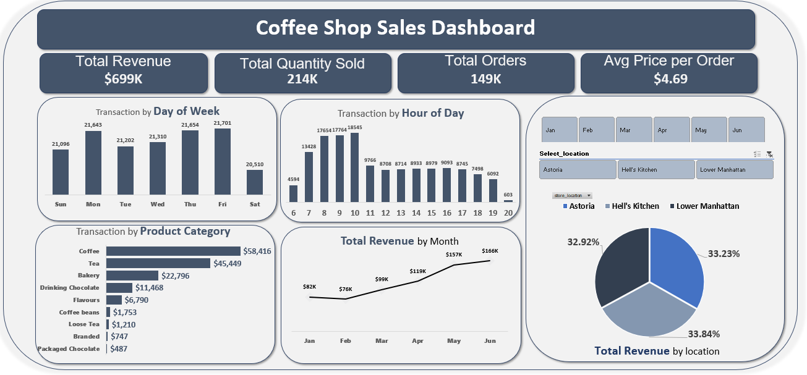

# ☕ Coffee Shop Sales Dashboard (Excel Project)

## 📌 Project Overview
This project analyzes sales data from a coffee shop chain to identify revenue drivers, customer behavior, and opportunities for growth.  
The goal was to practice **data cleaning, dashboard building, and business insights** using Excel.

---

## 📂 Dataset
The dataset includes:
- **Transaction details** (ID, date, time, quantity, store, product info)
- **Store details** (store ID, location)
- **Product details** (category, type, unit price)
- **Derived fields** (Revenue, Month, Weekday, Hour)

---

## ❓ Business Question
**How can we increase revenue and optimize store performance across days, times, and product categories?**

---

## 📊 Key Insights
- **Total Revenue:** 669K from 149K orders  
- **Average Order Value:** $4.69  
- **Total Quantity Sold:** 214K units  
- **Thursday & Friday** → highest sales (good for promotions)  
- **Saturday** → weakest day (needs offers/discounts)  
- **Peak Hours:** 8–10 AM (breakfast & work start)  
- **Top Products:** Coffee & Tea (cross-sell with snacks)  
- **Branches:** consistent sales across locations  

---

## 🛠️ Tools & Methods
- **Excel** → data cleaning, calculations, and dashboard creation  
- **PivotTables & PivotCharts** → trend analysis  
- **Conditional Formatting** → highlight performance  

---

## ⚙️ Process Walkthrough
1. **Data Cleaning:** removed duplicates, formatted dates & times  
2. **Feature Engineering:** added Revenue, Month, Weekday, Hours  
3. **Dashboard Design:** KPIs + charts answering business questions  

---

## 📸 Dashboard Preview
  

🔗 Connect with me on [LinkedIn](https://www.linkedin.com/in/naderemam)  
